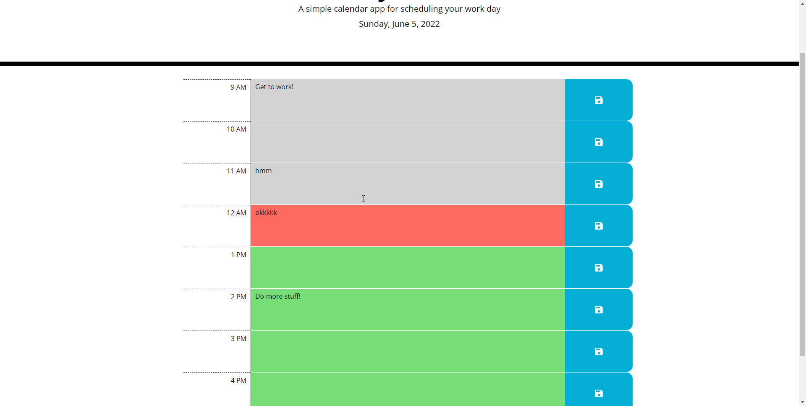

# Challenge 5: Work Day Scheduler
This website is a work day scheduler made in HTML and Javascript
This website uses both Bootstrap and jQuery for its primary functionality.

Features:
- All notes are stored in localStorage for data persistence.
- Each hour changes color based on local time. Red = current, Green = future, Gray = past.

Live URL: https://stratiz.github.io/challenge-5-work-day-scheduler/

